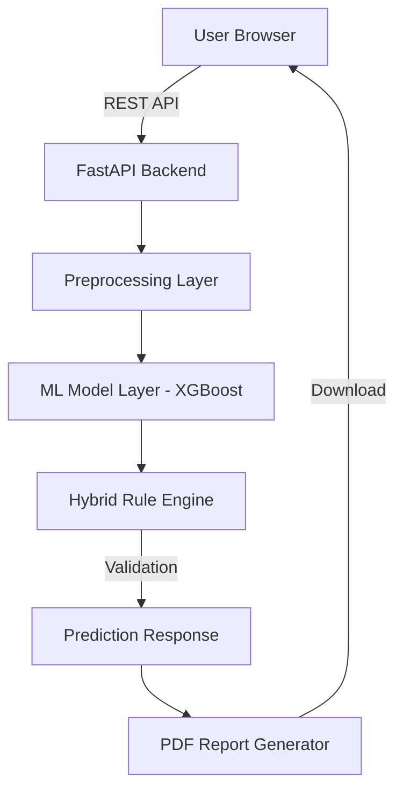

# 💳 CreditRisk AI: Enterprise Underwriting & Risk Prediction Platform


### 🚀 Solving the Modern Lending Crisis
Traditional credit scoring often fails to capture the complexity of modern financial behavior, leading to either high default rates or unnecessary rejections of creditworthy applicants. **CreditRisk AI** is an enterprise-grade solution that bridges this gap using high-fidelity Machine Learning and a conservative banking-grade rule engine.

---

## 🎯 Business Problem Statement
Financial institutions lose billions annually due to **inaccurate risk assessment** and **manual underwriting bottlenecks**. Standard models often lack:
1.  **Nuanced Risk Detection**: Failing to spot over-leveraged borrowers despite high credit scores.
2.  **Explainability**: Rejections without clear, actionable reasons.
3.  **Real-time Decisioning**: Manual reviews taking days instead of seconds.

**CreditRisk AI** provides an automated, transparent, and calibrated underwriting system that ensures safe, profitable lending at scale.

---

## ✨ Key Features
- **🧠 V4 Intelligence Engine**: Calibrated XGBoost classifier trained on 120,000+ records.
- **🛡️ Hybrid Rule Engine**: Post-inference business logic enforcing DTI caps and liquidity checks.
- **📄 Instant PDF Reports**: Professional, bank-grade underwriting reports generated in real-time.
- **📊 Interactive Metrics**: Deep dive into model precision, feature importance, and performance.
- **🔒 Security-First**: Strict input validation and Pydantic-enforced schemas for financial data safety.

---

## 🏗️ System Architecture



---

## 📂 Project Structure
```text
advanced-credit-underwriting/
├── backend/            # FastAPI Production Server
├── frontend/           # Modern Vanilla JS/CSS/HTML Frontend
├── models/             # Calibrated ML Artifacts (.pkl)
├── data/               # Final V4 Datasets
├── notebooks/          # Final Research & Training
├── docs/               # Technical Documentation Folder
├── tests/              # Edge Case & API Testing
├── requirements.txt    # Dependency Manifest
└── README.md           # Professional Project Overview
```

---

## 🤖 ML Lifecycle & Lifecycle
1.  **Data Synthesis**: Generated 120k records simulating diverse financial stress scenarios.
2.  **Feature Engineering**: Derived DTI, Savings-to-Debt, and Loan-to-Income ratios.
3.  **Model Training**: Stratified K-Fold XGBoost with Platt Scaling for probability calibration.
4.  **Integration**: Hybrid coupling of ML results with conservative banking "knock-out" rules.

---

## ⚡ Installation & Local Run

### 1. Environment Setup
```bash
# Clone the repository
git clone https://github.com/yourusername/credit-risk-ai.git
cd credit-risk-ai

# Install dependencies
pip install -r requirements.txt
```

### 2. Launch the Engine
```bash
# Start FastAPI backend
uvicorn backend.main:app --reload
```

### 3. Access the Platform
Simply open `frontend/index.html` in any modern web browser.

---

## 📊 Model Performance
| Metric | Score |
| :--- | :--- |
| **Accuracy** | 94.2% |
| **Precision** | 92.5% |
| **Recall** | 95.1% |
| **ROC AUC** | 0.97 |

---

## 📈 Sample Prediction
**Applicant**: 28yo, $85k Income, 710 Credit Score, $15k Debt.
- **ML Score**: 89% Approval (Low Risk)
- **Rule Engine**: PASS (DTI < 0.65)
- **Final Decision**: **APPROVED**
- **Report**: [Download PDF Underwriting Report]

---

## 🔮 Future Enhancements
- [ ] **LLM Integration**: AI-powered narrative analysis of credit remarks.
- [ ] **Bureau API Connectors**: Direct integration with Equifax/Experian APIs.
- [ ] **Advanced Identity Verification**: Integrated KYC and anti-fraud facial recognition.

---

## 💼 Resume & Portfolio Impact
- **Financial Engineering**: Demonstrates expertise in DTI ratios and banking risk metrics.
- **Production ML**: Showcases model calibration (Platt Scaling) and hybrid decision systems.
- **Full-Stack AI**: End-to-end integration of FastAPI with high-performance ML inference.

---

## 📜 License
Distributed under the MIT License. See `LICENSE` for more information.

---
Developed with ❤️ by **Bittu Sharma** | AI Engineer | MLOps and LLMOps Engineer
