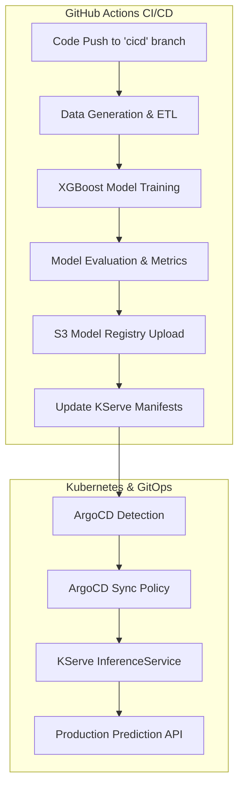

# 💳 CreditRisk AI: Enterprise MLOps Underwriting Engine


An industry-standard, end-to-end MLOps platform for Credit Risk Underwriting. This project automates the entire machine learning lifecycle—from synthetic data generation and model training to serverless deployment on Kubernetes via KServe and GitOps orchestration with ArgoCD.

---

## 🎯 Business Problem & Solution
Traditional credit underwriting is slow, manual, and prone to inconsistent decision-making. **CreditRisk AI** solves this by providing:
- **Automated Intelligence**: Real-time risk classification (Low, Medium, High, Fraud).
- **Scalable Infrastructure**: Containerized inference endpoints capable of handling high-frequency banking requests.
- **Continuous Evolution**: Automated retraining pipelines that ensure models stay updated with the latest financial trends.

---

## 🏗️ MLOps Architecture (GitOps Flow)

The system utilizes a modern GitOps pattern where the "Single Source of Truth" resides in the repository.



---

## 📂 Project Engineering Structure
```text
credit-risk-ai-underwriting/
├── .github/workflows/   # CI/CD Pipeline Definitions (YAML)
├── src/                 # Core MLOps Logic (Generation, Training, Eval)
├── k8s/                 # Kubernetes Manifests (InferenceService, RBAC, ArgoCD)
├── artifacts/           # Model Performance Reports & Metrics
├── models/              # Local Cache for Trained Artifacts (Git Ignored)
├── data/                # Sample Datasets for Pipeline Testing
├── docs/                # Technical Whitepapers & Data Dictionaries
└── requirements.txt     # Production Dependency Manifest
```

---

## 🛠️ Technology Stack
- **ML Framework**: XGBoost, Scikit-Learn, Pandas
- **Orchestration**: Kubernetes (K8s), KServe
- **GitOps**: ArgoCD
- **Automation**: GitHub Actions
- **Storage**: Amazon S3 (Model Registry)
- **API Framework**: FastAPI (Local Testing) / KServe (Production)

---

## 🚀 Deployment & Operations Guide

### 1. Model Registry (S3) Setup
Ensure an S3 bucket named `credit-risk-bucket` exists. The pipeline will automatically version and upload models to `s3://credit-risk-bucket/models/`.

### 2. Infrastructure Configuration
Add your AWS credentials to **GitHub Secrets**:
- `AWS_ACCESS_KEY_ID`
- `AWS_SECRET_ACCESS_KEY`

### 3. Initialize GitOps (ArgoCD)
Connect your cluster to the repository using the ArgoCD Application manifest:
```bash
kubectl apply -f k8s/argocd-app.yaml
```

### 4. Retraining Pipeline
To trigger a full production retraining and redeployment:
1. Make changes to `src/train.py` or `src/generate_data.py`.
2. Push to the `cicd` branch.
3. Observe the GitHub Action log and the ArgoCD dashboard for automatic sync.

---

## 📊 Model Intelligence
- **Input Features**: Age, Income, Credit Score, Loan Amount, Debt Ratio, Employment Stability.
- **Output Classes**: `Low Risk`, `Medium Risk`, `High Risk`, `Fraud Review`.
- **Inference Strategy**: KServe `Predictor` with `sklearn` runtime.

---

## 🛡️ Security & Compliance
- **RBAC**: Dedicated ServiceAccounts with least-privilege S3 access.
- **Secrets Management**: Kubernetes Opaque Secrets for AWS credential injection.
- **Namespace Isolation**: Full isolation within the `credit-risk-model` namespace.

---
Developed with ❤️ by **Bittu Sharma** | AI Engineer | MLOps and LLMOps Engineer
