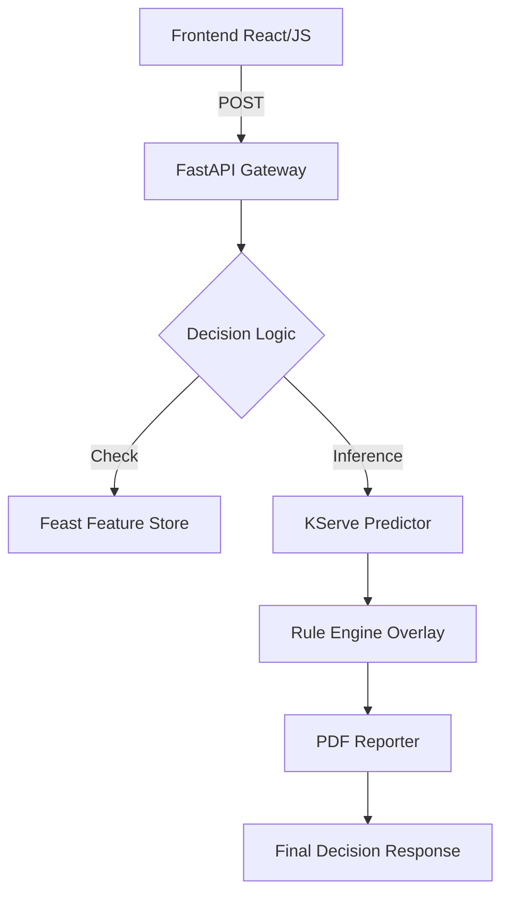
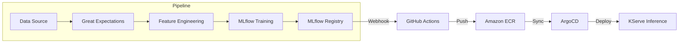

# 🏦 CreditRisk AI: Enterprise Underwriting & MLOps Platform (2026 Edition)


An end-to-end, banking-grade Credit Risk Underwriting ecosystem. This platform automates the entire ML lifecycle—from high-fidelity data synthesis and Airflow-orchestrated training to serverless inference on AWS EKS using KServe and GitOps delivery with ArgoCD.

---

## 📖 Table of Contents
1.  [Project Overview](#-project-overview)
2.  [Key Features](#-key-features)
3.  [Architectures](#-architectures)
4.  [Folder Structure](#-folder-structure)
5.  [Local Quick Start (Kind)](#-local-quick-start)
6.  [AWS Production Deployment](#-aws-production-deployment)
7.  [MLOps Lifecycle](#-mlops-lifecycle)
8.  [Monitoring & Security](#-monitoring--security)
9.  [API Reference](#-api-reference)
10. [Resume & Interview Impact](#-resume--interview-impact)

---

## 🌟 Project Overview
Financial institutions face the "Explainability vs. Accuracy" dilemma in credit scoring. **CreditRisk AI** provides a solution using calibrated **XGBoost** and **CatBoost** models, wrapped in a deterministic banking rule engine, and deployed on a robust cloud-native infrastructure.

---

## 🔥 Key Features
- **🧠 Multi-Model Ensemble**: Hybrid logic combining XGBoost, LightGBM, and CatBoost.
- **🛡️ Hybrid Decisioning**: Post-inference rule-engine for regulatory "knock-out" rules.
- **📄 Pro-Grade Reporting**: Instant PDF generation for regulatory audit trails.
- **🔁 Auto-Retraining**: Airflow-driven pipelines that detect drift and trigger model updates.
- **📊 Observability**: Full Prometheus/Grafana dashboards for drift, latency, and approval ratios.
- **🔐 Banking Security**: JWT Auth, IAM least-privilege, and automated Snyk/Trivy security scans.

---

## 🏗️ Architectures

### 1. Application Flow


### 2. MLOps Lifecycle


---

## 📂 Folder Structure
```text
credit-risk-ai-underwriting/
├── backend/            # FastAPI Enterprise Gateway
├── frontend/           # Portfolio-ready Underwriting UI
├── training/           # Research, Tuning, and MLflow scripts
├── inference/          # KServe custom predictors & transformers
├── pipelines/          # Apache Airflow DAGs
├── kubernetes/         # Helm Charts & Native Manifests
├── kserve/             # InferenceService Definitions
├── terraform/          # AWS EKS & IAM Infrastructure as Code
├── argocd/             # GitOps Application Manifests
├── monitoring/         # Grafana Dashboards & Prometheus Config
├── security/           # JWT, IAM, and Trivy scan scripts
└── docs/               # 22-File Professional Documentation Suite
```

---

## ⚡ Local Quick Start (Kind Cluster)

### Prerequisites
- Docker, Kind, Kubectl, Helm

### 1. Create Cluster
```bash
kind create cluster --name credit-risk --config scripts/kind-config.yaml
```

### 2. Install KServe & ArgoCD
```bash
helm install kserve-stack ./kubernetes/charts/kserve
kubectl apply -n argocd -f argocd/argocd-app.yaml
```

### 3. Deploy Local Model
```bash
kubectl apply -f kserve/inference-local.yaml
```

---

## ☁️ AWS Production Deployment

### 1. Infrastructure (Terraform)
```bash
cd terraform
terraform init && terraform apply -auto-approve
```

### 2. EKS Configuration
```bash
aws eks update-kubeconfig --name credit-risk-prod --region us-east-1
kubectl apply -f kubernetes/alb-controller.yaml
```

---

## 📊 API Reference

| Endpoint | Method | Description |
| :--- | :--- | :--- |
| `/predict` | `POST` | High-fidelity single applicant underwriting |
| `/batch-predict` | `POST` | CSV-based bulk processing (S3 integration) |
| `/retrain` | `POST` | Triggers Airflow retraining pipeline |
| `/explain` | `GET` | Returns decision reasoning and feature contribution |

---

## 💼 Resume & Interview Value
- **Architectural Depth**: Demonstrates knowledge of **KServe**, **ArgoCD**, and **EKS**.
- **Data Integrity**: Uses **Great Expectations** and **Feast** for feature consistency.
- **Cloud Native**: Full **Terraform** implementation of EKS and IAM.
- **Security**: Implements **JWT** and **RBAC** in a financial context.

---

## 📜 License
Distributed under the MIT License. See `LICENSE` for more information.

---
Developed with ❤️ by **Bittu Sharma** | Principal MLOps Architect
