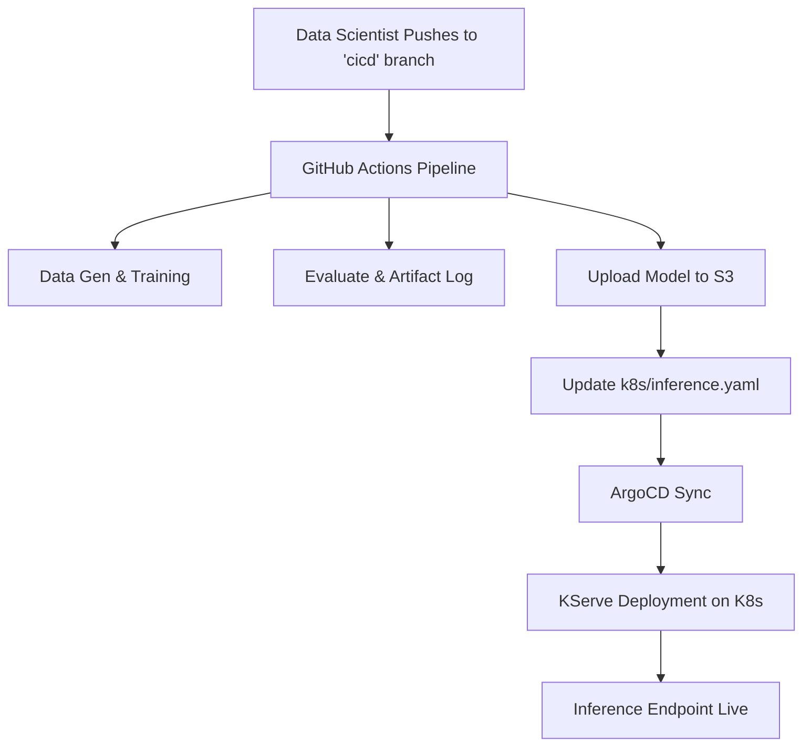

# 💳 CreditRisk AI: Enterprise MLOps Platform

An end-to-end production-grade MLOps platform for Credit Risk Underwriting, featuring automated training, S3 model versioning, and KServe inference on Kubernetes.

## 🏗️ MLOps Architecture
The system follows a GitOps workflow using ArgoCD and KServe:



## 📂 Project Structure
- `src/`: Core training, generation, and evaluation scripts.
- `k8s/`: Kubernetes manifests for KServe and ArgoCD.
- `.github/workflows/`: Automated CI/CD pipeline.
- `models/`: Local model cache (ignored by git).
- `artifacts/`: Model evaluation metrics and metadata.

## 🚀 Deployment Guide

### 1. S3 Setup
Create an S3 bucket named `credit-risk-bucket` and ensure your AWS credentials have write access.

### 2. GitHub Secrets
Add the following secrets to your GitHub repository:
- `AWS_ACCESS_KEY_ID`
- `AWS_SECRET_ACCESS_KEY`

### 3. Kubernetes Setup
Install KServe and ArgoCD on your cluster.
Apply the ArgoCD Application manifest:
```bash
kubectl apply -f k8s/argocd-app.yaml
```

### 4. Continuous Deployment
Every push to the `cicd` branch triggers:
1.  **Automated Training**: Regenerates data and trains the XGBoost model.
2.  **S3 Upload**: Pushes the new `.pkl` artifacts to your model registry.
3.  **GitOps Update**: Updates `inference.yaml` with the latest model path.
4.  **Auto-Sync**: ArgoCD detects the change and redeploys the KServe InferenceService.

---
Developed with ❤️ by **Bittu Sharma** | AI Engineer | MLOps and LLMOps Engineer
