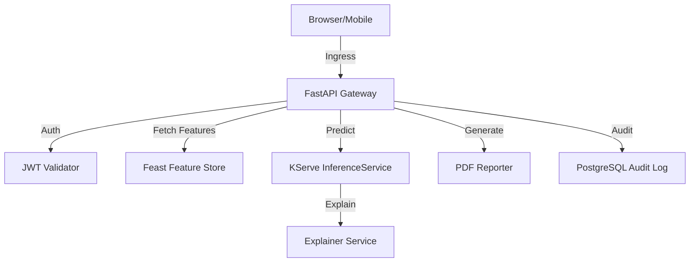

# Application Architecture

## 1. Component Diagram

## 2. Key Components
- **FastAPI Gateway**: Handles request routing, authentication, and orchestration of the inference flow.
- **Feast Feature Store**: Ensures the features used during training are identical to those used in production.
- **KServe**: Provides a serverless wrapper around the model, supporting canary deployments and auto-scaling.
- **Rule Engine Overlay**: A deterministic layer that checks for "Hard Rejections" (e.g., minimum income).
