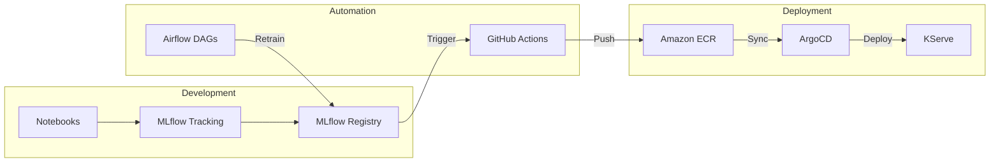

# MLOps Architecture

## 1. Lifecycle Diagram

## 2. Tool Integration
- **DVC**: Manages data versioning to ensure reproducibility.
- **MLflow**: Tracks experiments, parameters (Learning Rate, Max Depth), and versions the final model.
- **Evidently AI**: Monitors model drift in production by comparing incoming feature distributions with training data.
- **Airflow**: Orchestrates the retraining pipeline when drift exceeds a specific threshold.
