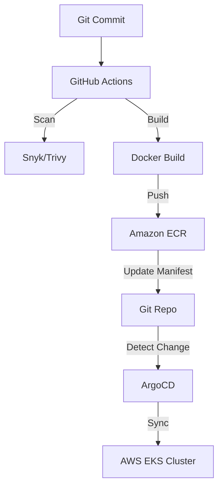

# DevOps & GitOps Architecture

## 1. CI/CD Flow

## 2. Key Principles
- **GitOps**: All infrastructure and application states are defined in Git.
- **Immutable Artifacts**: Docker images are tagged with unique SHAs and never overwritten.
- **Automated Security**: Trivy scans images for vulnerabilities before they reach the registry.
