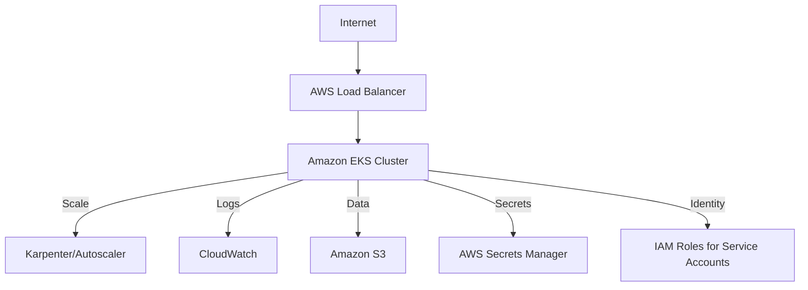

# AWS Production Architecture

## 1. Cloud Ecosystem

## 2. Infrastructure as Code (Terraform)
- **VPC Module**: Configures Public/Private subnets across 3 Availability Zones.
- **EKS Module**: Manages the Managed Node Groups and OIDC provider.
- **ALB Controller**: Dynamically creates AWS Application Load Balancers for Kubernetes Ingress resources.
- **IAM (IRSA)**: Ensures Pods have specific, least-privilege access to S3 and Secrets Manager without using long-lived keys.
