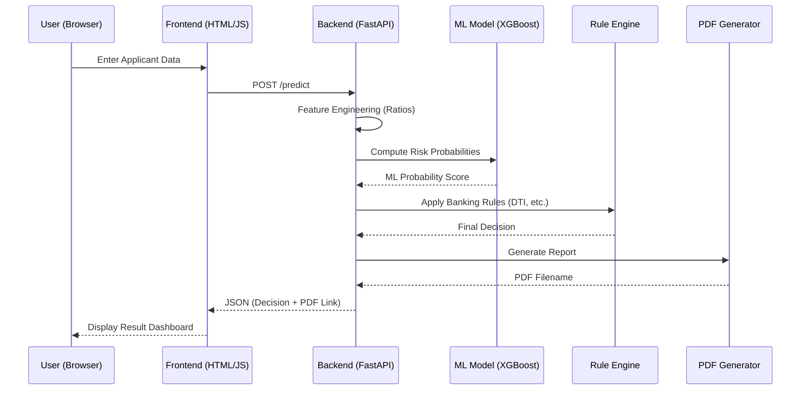

# App Architecture

This document details the data flow and component interaction within the CreditRisk AI application.

## High-Level Flow
The system operates as a **Request-Response** cycle triggered by a user application.

## Component Details
1. **Frontend**: A vanilla JS interface that performs input validation and handles asynchronous API communication.
2. **FastAPI Backend**: The orchestrator. It handles concurrency, model invocation, and business logic execution.
3. **Preprocessing Layer**: Translates raw input (Age, Income) into calculated financial ratios (DTI, STD) that the model and rules require.
4. **ML Model Layer**: An XGBoost classifier that provides the statistical "probability of default" based on historical patterns.
5. **Rule Engine**: A deterministic layer that enforces non-negotiable banking policies (e.g., rejecting if DTI > 65%).
6. **PDF Report Generator**: A professional reporting module that serializes the decision logic into a portable document.
