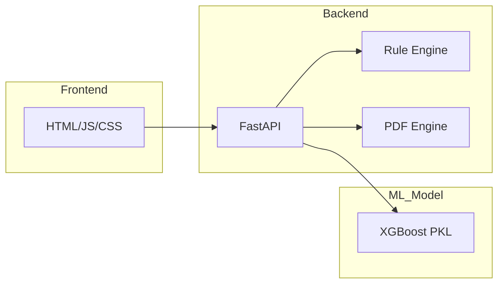

# Project Architecture & Ecosystem

This document provides a holistic view of the CreditRisk AI project ecosystem, from training to inference.

## 1. Data Layer
- **Source**: Synthetic V4 Enterprise Dataset (120,000 records).
- **Storage**: CSV-based storage for training; real-time JSON input for inference.

## 2. ML Training Pipeline
- **Environment**: Jupyter Notebooks (`notebooks/final_training.ipynb`).
- **Algorithm**: XGBoost (eXtreme Gradient Boosting).
- **Optimization**: Stratified K-Fold validation to ensure stability across risk classes.
- **Serialization**: Models are saved as `.pkl` artifacts using `joblib`.

## 3. Backend (Enterprise API)
- **Framework**: FastAPI (Asynchronous).
- **Validation**: Pydantic models for strict data type enforcement.
- **Routers**: Modular route handling for single-applicant underwriting.

## 4. Underwriting Intelligence
- **ML Component**: Statistical risk scoring.
- **Deterministic Component**: The Rule Engine (`rule_engine.py`) enforces regulatory compliance.

## 5. Deployment Structure (Local)
The system is designed for local institutional use, serving a responsive frontend via standard web ports and a high-performance API on port 8000.

